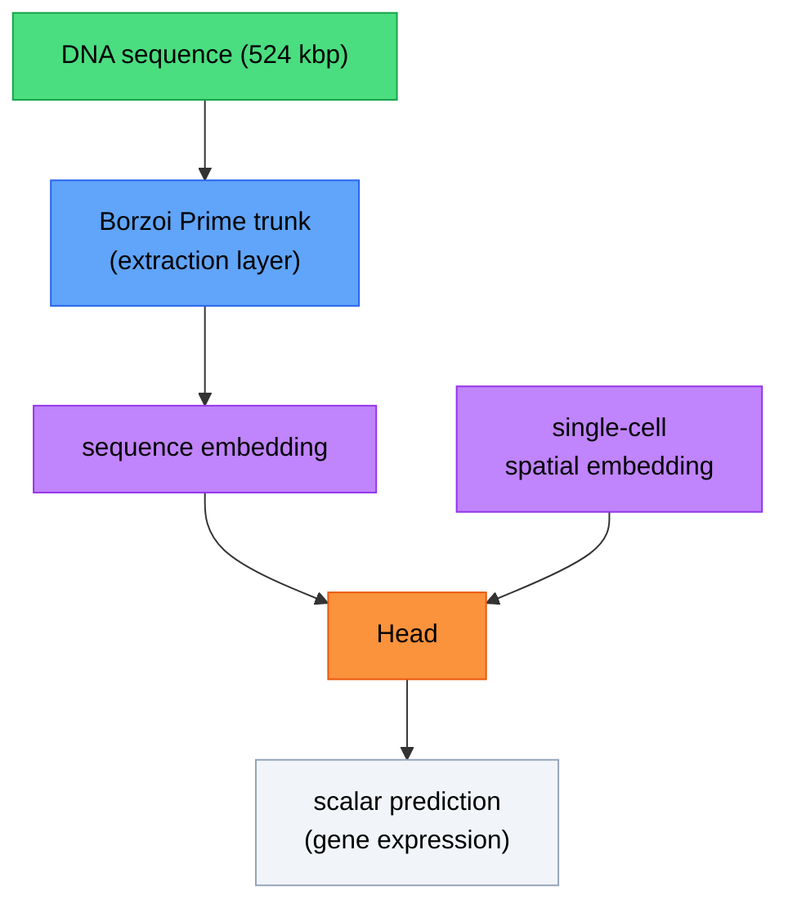

# Laika

Predict spatial gene expression from DNA sequences and single-cell embeddings using a pretrained genomic trunk (e.g., Borzoi Prime) and task-specific heads.

## Installation

```bash
cd Laika
pip install -e .
```

## Architecture



## Overview

- **Trunk**: Borzoi-based sequence encoder with optional LoRA fine-tuning
- **Data**: Sequence-based and precomputed-embedding data pipelines
- **Training**: Configurable experiment runner with custom losses and W&B logging
- **Evaluation**: Per-gene correlation metrics and plots

## Heads

Multiple architectures for spatial gene expression prediction. Details: [heads/README.md](src/laika/heads/README.md)

## Quick start

Examples: [`/examples`](/examples/)

```python
import laika

# Full experiment from config
result = laika.run_experiment(config)

# Or components individually
model = laika.Laika(config.model)
trainer = laika.Trainer(model, config.training)
predictor = laika.Predictor(model)
```

## Documentation

Full API documentation: [https://lukasvermeire.github.io/Laika/laika.html](https://lukasvermeire.github.io/Laika/laika.html)

## Dependencies

`torch`, `numpy`, `scipy`, `anndata`, `crested`, `matplotlib`, `tqdm`, `loguru`

Optional: `wandb` — `pip install -e ".[logging]"`
