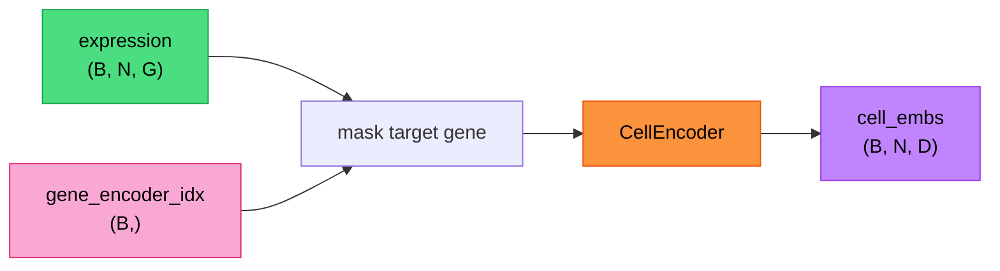
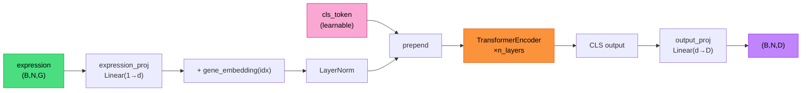

# Cell Encoders

All encoders take `(expression: (B,N,G), gene_indices_to_mask: (B,))` and return `(B,N,D)` cell embeddings (the same shape the heads expect for `cell_embs`).

The target gene is **masked before encoding** (column zeroed out) to prevent information leakage when predicting gene *g* from cell expression that includes *g*.

---

## Available Encoders

### 1. Transformer (`"transformer"`)

Treats each gene as a token: the scalar expression value is projected to `d_model` and added to a per-gene identity embedding. A learnable CLS token is prepended, a standard transformer encoder processes the sequence, and the CLS output is projected to the final embedding dimension.

