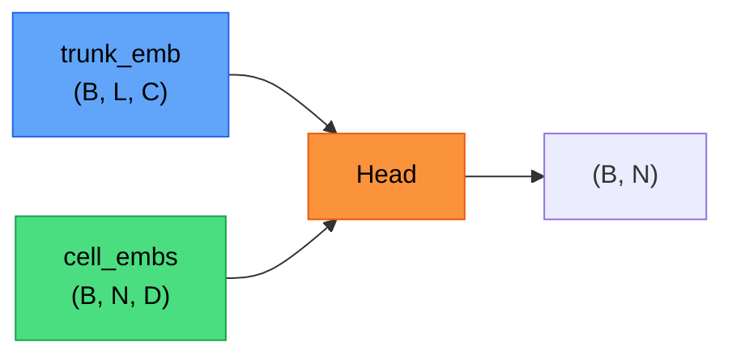
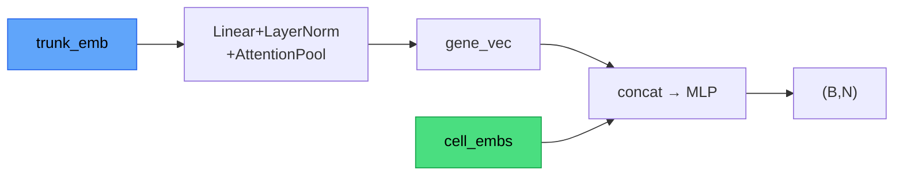
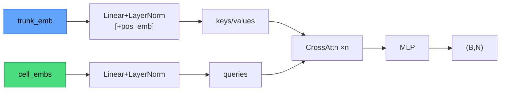
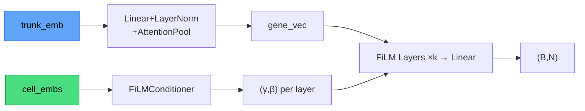
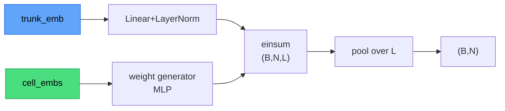
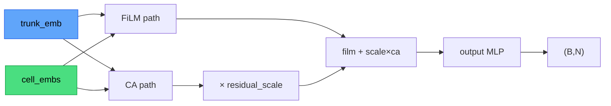
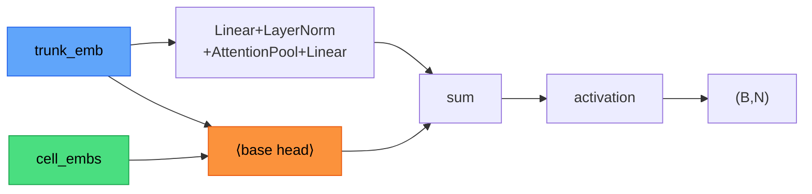
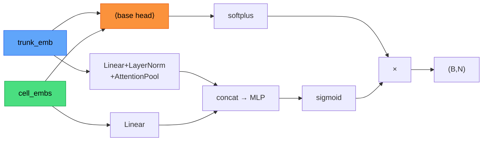

# Prediction Heads

All heads take `(trunk_emb: (B,L,C), cell_embs: (B,N,D))` and return `(B,N)` predictions.

---

## Base Architectures

### 1. MLP (`"mlp"`)

Attention-pools the trunk to a single gene vector, concatenates it with each cell embedding, and runs a shared MLP.

### 2. Cross-Attention (`"cross_attention"`)

Cells attend to all trunk sequence positions via multi-head cross-attention.

### 3. FiLM (`"film"`)

Cell embeddings generate per-layer scale/shift parameters (γ, β) that modulate the gene representation.

### 4. HyperConv (`"hyperconv"`)

Each cell generates its own convolutional filter via a hypernetwork MLP. This filter is applied across all DNA sequence positions (einsum dot-product), producing per-cell positional scores that are then pooled to a scalar. Inspired by [Scooby](https://github.com/gagneurlab/scooby).

### 5. Hybrid (`"hybrid"`)

Keeps FiLM as the main path and adds cross-attention as a small learned residual.

---

## Wrapper Architectures

These heads wrap any base head above and augment it with additional structure.

### 1. Decomposed (`"decomposed"`)

**Motivation:** Disentangles the gene's average expression level (driven by DNA) from cell-type-specific variation.

Additively decomposes prediction into a DNA-only baseline and a cell-specific residual: `y = μ(gene) + interaction(gene, cell)`.

### 2. Hurdle (`"hurdle"`)

**Motivation:** Spatial transcriptomics data is highly sparse (~70% zeros). The hurdle model separates the two problems.

Independently predicts whether a gene is expressed (binary gate) and how much (regression): `y = sigmoid(gate) × softplus(expression)`.

